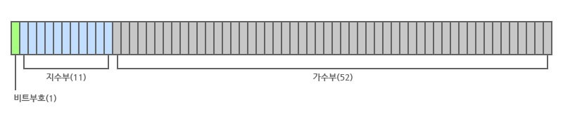

# 메모리

### 메모리와 데이터

컴퓨터는 모든 데이터를 0 또는 1로 바꿔 기억한다. 0 또는 1로 구성된 하나의 메모리 조각을 비트라고 하며 메모리 참조를 위한 편의상 8개의 비트로 구성된 바이트를 사용하여 데이터를 표현한다. 

* 1바이트 : \(2의 8승 = 256\)
* 2바이트 : \(2의 16승 = 65536\)

다른 프로그래밍 언어는 메모리 관리를 위해 데이터 타입별로 바이트를 제한했지만, 자바스크립트는 이에 상대적으로 관대하여 모든 데이터 타입에 64비트 \(8바이트\)를 할당했다.  
이 중 1비트는 부호, 11비트는 지수부, 나머지 52비트는 가수부이다.



### 데이터 할당

기본형 데이터의 경우 아래처럼 메모리 영역이 구성된다.

```javascript
var a = 'abc'
```

<table>
  <thead>
    <tr>
      <th style="text-align:left">&#xAD6C;&#xBD84;</th>
      <th style="text-align:left">&#xC8FC;&#xC18C;</th>
      <th style="text-align:left">&#xB370;&#xC774;&#xD130;</th>
    </tr>
  </thead>
  <tbody>
    <tr>
      <td style="text-align:left">&#xBCC0;&#xC218; &#xC601;&#xC5ED;</td>
      <td style="text-align:left">1001</td>
      <td style="text-align:left">
        <p>name : a</p>
        <p>value: @5001</p>
      </td>
    </tr>
    <tr>
      <td style="text-align:left">&#xB370;&#xC774;&#xD130; &#xC601;&#xC5ED;</td>
      <td style="text-align:left">5001</td>
      <td style="text-align:left">abc</td>
    </tr>
  </tbody>
</table>


별도의 공간에 데이터를 저장하여 같은 데이터 값을 공유하거나 데이터 변경에 따라 유연하게 공간 변경이 가능하도록 한다.


참조형 데이터의 경우 아래처럼 메모리 영역이 구성된다.

```javascript
var obj = {
  a: 3
};
```

<table>
  <thead>
    <tr>
      <th style="text-align:left">&#xAD6C;&#xBD84;</th>
      <th style="text-align:left">&#xC8FC;&#xC18C;</th>
      <th style="text-align:left">&#xB370;&#xC774;&#xD130;</th>
    </tr>
  </thead>
  <tbody>
    <tr>
      <td style="text-align:left">&#xBCC0;&#xC218; &#xC601;&#xC5ED;</td>
      <td style="text-align:left">1001</td>
      <td style="text-align:left">
        <p>name : obj</p>
        <p>value: @5001</p>
      </td>
    </tr>
    <tr>
      <td style="text-align:left">&#xB370;&#xC774;&#xD130; &#xC601;&#xC5ED;</td>
      <td style="text-align:left">5001</td>
      <td style="text-align:left">@7001</td>
    </tr>
    <tr>
      <td style="text-align:left">&#xB370;&#xC774;&#xD130; &#xC601;</td>
      <td style="text-align:left">5002</td>
      <td style="text-align:left">3</td>
    </tr>
    <tr>
      <td style="text-align:left">&#xAC1D;&#xCCB4; &#xBCC0;&#xC218; &#xC601;&#xC5ED;</td>
      <td style="text-align:left">7001</td>
      <td style="text-align:left">
        <p>name: a</p>
        <p>value: @5002</p>
      </td>
    </tr>
  </tbody>
</table>


참조형 데이터를 복사한 객체의 프로퍼티는 @7001 데이터를 같이 바라보게 되므로 복사한 객체의 프로퍼티 변경시 원본 객체의 프로퍼티도 변경된다.


### V8 메모리 구조



