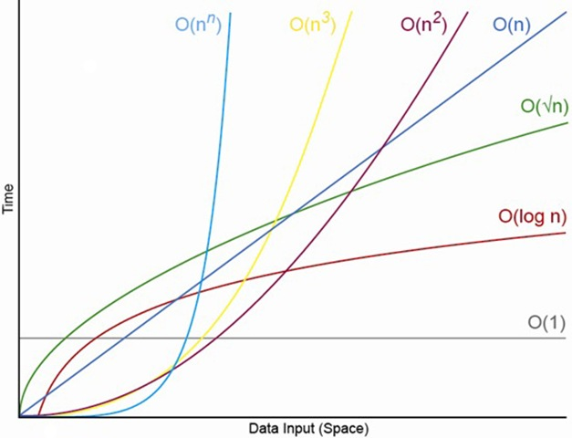

# 자료구조와 알고리즘

### 빅오 표기법

빅오 표기법은 알고리즘의 최악의 경우 복잡도를 측정한다.  
"n이 무한으로 접근할 때 무슨 일이 일어날까"를 고려해야 한다.



#### 시간 복잡도 호칭

* O\(1\) : 상수 시간
* O\(n\) : 선형 시간
* O\(n²\) : 2차 시간
* O\(n³\) : 3차 시간
* O\(㏒ n\) : 로그 시간

#### 빅오 표기법 법칙

**계수 법칙**

크기와 연관되지 않은 상수를 전부 무시한다.

```javascript
function a(n) {
  var count = 0;
  for (var i = 0; i < 5 * n; i++) {
    count += 1;
  }
  return count;
}
```

위 코드는 f\(n\) = 5n이지만 n이 무한대일때 상수 5가 있다고 해도 달라질게 없으므로 무시해도 된다.

**합의 법칙**

시간 복잡도를 더할 수 있다.

```javascript
function a(n) {
  var count = 0;
  for (var i = 0; i < n; i++) {
    count += 1;
  }
  for (var i = 0; i < 5 * n; i++) {
    count += 1;
  }
  return count;
}
```

결과값은 f\(n\) = 1n + 5n 이며 계수 법칙을 적용하면 시간 복잡도는 O\(n\) 이다.

**곱의 법**

중첩 루프에 곱을 적용한다.

```javascript
function a(n) {
  var count = 0;
  for (var i = 0; i < n; i++) {
    count += 1;
    for (var i = 0; i < 5 * n; i++) {
      count += 1;
    }
  }
  return count;
}
```

결과값은 f\(n\) = 1n \* 5n = 5n² 이며 계수 법칙을 적용하면 시간 복잡도는 O\(n²\) 이다.

**다항 법칙**

시간 복잡도가 다항식일 경우 다항 차수를 적용한다.

```javascript
function a(n) {
  var count = 0;
  for (var i = 0; i < n * n; i++) {
    count += 1;
  }
  return count;
}
```

결과값은 f\(n\) = n² 이며 시간 복잡도는 O\(n²\) 이다.

